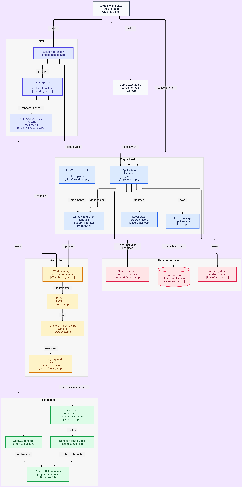

# SunsetEngine

SunsetEngine est un moteur et framework applicatif modulaire en **C++23**. Ce projet de portfolio explore la conception d'un runtime réutilisable : une base pour créer des jeux, mais aussi, à terme, des applications interactives hors jeu vidéo.

Le dépôt rassemble le moteur, une application de jeu d'exemple et un éditeur en cours de construction. L'objectif est de travailler des sujets d'architecture concrets : séparation des responsabilités, abstractions de plateforme et de rendu, ECS, chargement de modules et outils de création.

## En bref

- Runtime applicatif avec boucle principale, pile de layers, événements, entrées et mode headless.
- Game framework fondé sur **EnTT** : mondes, entités, composants, systèmes et scripts C++ natifs.
- Rendu à API abstraite, avec backend **OpenGL** actif et point d'extension Vulkan.
- Services intégrés : réseau **ENet**, audio OpenAL, sérialisation binaire, réflexion légère, logs et profiling.
- UI retained-mode avec SRmGUI et éditeur basé sur ImGui, Gizmo et node editor.
- Documentation d'architecture versionnée, écrite pour être consultée dans **Obsidian**.

## Architecture

Le workspace CMake construit le moteur, puis compose un runtime avec les modules de plateforme et de rendu sélectionnés. Les applications de jeu et l'éditeur utilisent ce runtime sans dépendre directement des détails OpenGL ou GLFW.

<details>
<summary>Afficher le diagramme d'architecture</summary>

<a href="Resources/SunsetEngine_Diagram.png">
  
</a>

Cliquez sur l'image pour l'ouvrir en taille réelle.
</details>

| Domaine | Rôle |
| --- | --- |
| **Core** | Cycle de vie de l'application, layers, fenêtre, événements et entrées. |
| **GameFramework** | Mondes ECS, entités, composants, systèmes, scripts et gestion des scènes. |
| **Render** | Construction de scène, ressources graphiques, commandes et abstraction `RenderAPI`. |
| **Platform / RenderAPI** | Implémentations interchangeables de fenêtre et de backend graphique ; GLFW et OpenGL sont actuellement utilisés. |
| **Runtime services** | Réseau, audio, sauvegarde, logs, profiling et réflexion. |
| **Editor** | Application de validation et outils d'édition en cours de développement. |

## Structure du dépôt

```text
Engine/             Runtime et systèmes du moteur
Platform/           Implémentations de plateforme, dont GLFW
RenderAPI/          Backends graphiques, dont OpenGL et une base Vulkan
Game/               Application de jeu et module d'exemple Pong
Editor/             Éditeur construit au-dessus du runtime
SunsetEngineDoc/    Documentation d'architecture pour Obsidian
Resources/          Ressources du dépôt, dont le diagramme d'architecture
Thirdparty/         Dépendances vendoriées (FastNoiseSIMD, SRmGUI)
```

## Compiler le projet

### Prérequis

- Compilateur compatible C++23.
- CMake 3.28 ou plus récent.
- [vcpkg](https://github.com/microsoft/vcpkg), recommandé pour les dépendances du manifeste.
- Un pilote OpenGL pour les applications graphiques.

Le manifeste vcpkg déclare notamment EnTT, GLFW, GLM, ENet, OpenAL, ImGui, spdlog et les bibliothèques nécessaires à l'éditeur.

```bash
git clone https://github.com/SunvyWasTaken/SunsetEngine.git
cd SunsetEngine

cmake -S . -B build \
  -DCMAKE_TOOLCHAIN_FILE=/chemin/vers/vcpkg/scripts/buildsystems/vcpkg.cmake
cmake --build build
```

Les options CMake principales sont :

| Option | Valeur par défaut | Effet |
| --- | --- | --- |
| `SUNSET_BUILD_EDITOR` | `ON` | Compile l'exécutable `SunsetEditor`. |
| `SUNSET_USE_GLFW` | `ON` | Ajoute la plateforme GLFW au runtime. |
| `SUNSET_USE_OPENGL` | `ON` | Ajoute le backend OpenGL au runtime. |
| `SUNSET_USE_VULKAN` | `OFF` | Active le point d'intégration du backend Vulkan. |

## Utiliser le runtime dans un projet CMake

Ajoutez SunsetEngine comme sous-répertoire, puis liez l'interface `Sunset::Runtime`. Elle rassemble `Sunset::Engine` avec les implémentations de plateforme et de rendu activées par la configuration CMake.

```cmake
add_subdirectory(path/to/SunsetEngine)
target_link_libraries(MyApplication PRIVATE Sunset::Runtime)
```

`Sunset::Engine` reste disponible lorsque seule la bibliothèque moteur est souhaitée. Les applications du dépôt (`SunsetGame` et `SunsetEditor`) servent de références d'intégration et de validation.

## Lire la documentation avec Obsidian

La documentation se trouve dans [`SunsetEngineDoc/`](SunsetEngineDoc). C'est un vault Obsidian versionné : ses liens `[[Nom de note]]` relient les concepts du moteur entre eux et les paramètres du vault sont fournis dans `SunsetEngineDoc/.obsidian/`.

1. Installez [Obsidian](https://obsidian.md), puis choisissez **Open folder as vault**.
2. Sélectionnez le dossier `SunsetEngineDoc` du clone local.
3. Commencez par les notes [Core](SunsetEngineDoc/Architecture/Core/Application.md), [GameFramework](SunsetEngineDoc/Architecture/GameFramework/World.md) et [Render](SunsetEngineDoc/Architecture/Render/Renderer.md).
4. Suivez les liens internes et ouvrez la **Graph view** pour visualiser les relations entre les systèmes.
5. Poursuivez selon le sujet : [réseau](SunsetEngineDoc/Architecture/Network/NetworkService.md), [sauvegarde](SunsetEngineDoc/Architecture/SaveSystem/SaveSystem.md), [éditeur](SunsetEngineDoc/Architecture/Editor/EditorApplication.md) ou [scripts natifs](SunsetEngineDoc/Architecture/GameFramework/ScriptRegistry.md).

Les notes décrivent l'intention architecturale, les responsabilités et les limites connues des systèmes. Elles complètent le code ; les marqueurs tels que `#Idea` ou `#Deprecated` signalent les éléments exploratoires ou remplacés.

## État du projet

SunsetEngine est un projet personnel en développement actif. Le runtime, les services et l'application d'exemple servent de terrain d'expérimentation ; l'éditeur continue d'évoluer pour valider les flux de création, de sérialisation et d'exécution de modules de jeu.

## Licence

Distribué sous licence [MIT](LICENSE).
